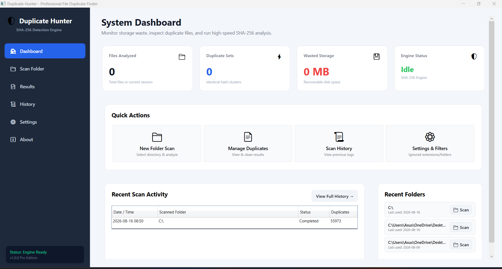
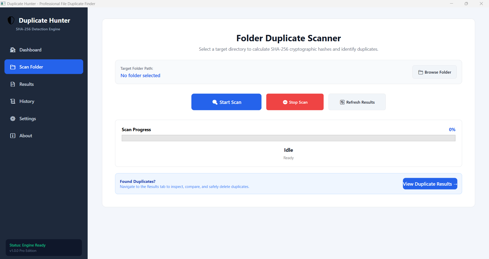
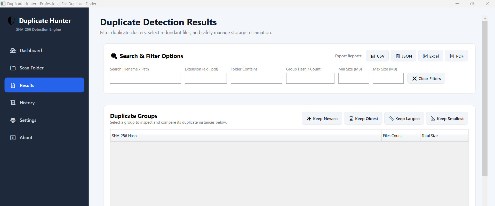
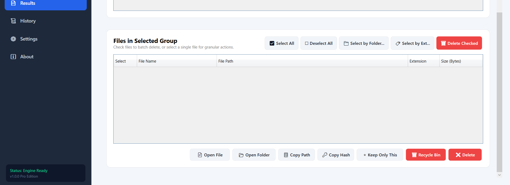
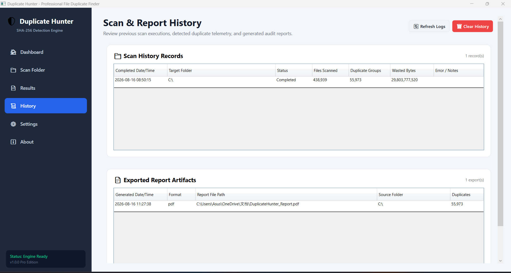

# 🔍 Duplicate Hunter

A modern Windows desktop application for detecting duplicate files using **SHA-256 hashing**. Built with **C#**, **.NET**, **WPF**, and the **MVVM** architecture.

🚀 Version 1.0 Release

Duplicate Hunter v1.0 is a release-ready Windows desktop application for detecting and managing duplicate files using SHA-256 hashing.
> ## ✨ Features

- 📁 Scan folders for duplicate files
- 🔐 SHA-256 file hashing for accurate detection
- 📊 Modern dashboard with scan statistics
- 🖥️ Built using the MVVM architecture
- ⚡ Fast and responsive Windows desktop application
- 🚧 Background scanning with live progress *(Coming Soon)*

## 🛠️ Technology Stack

- **Language:** C#
- **Framework:** .NET 10
- **UI:** WPF (Windows Presentation Foundation)
- **Architecture:** MVVM (Model-View-ViewModel)
- **Dependency Injection:** Microsoft.Extensions.Hosting
- **Hashing Algorithm:** SHA-256
- **Version Control:** Git & GitHub

## 🚀 Project Status

This project is actively being developed.

### Current Progress

✅ Professional WPF application structure
✅ MVVM architecture
✅ Folder selection
✅ SHA-256 duplicate detection
✅ Background scanning
✅ Scan cancellation
✅ Scan statistics dashboard
✅ Duplicate file grouping
✅ Advanced result filtering
✅ File selection management
✅ Recycle Bin deletion
✅ Permanent deletion with confirmation
✅ CSV report export
✅ JSON report export
✅ Excel report export
✅ PDF report export
✅ Scan history
✅ Settings persistence
✅ SQLite database
✅ Automated test suite — 40 tests passed
✅ Release build validation
✅ Published Windows executable

## 📸 Screenshots

### Dashboard

### Scan

### Results — Duplicate Groups

### Results — File Management

### Settings

